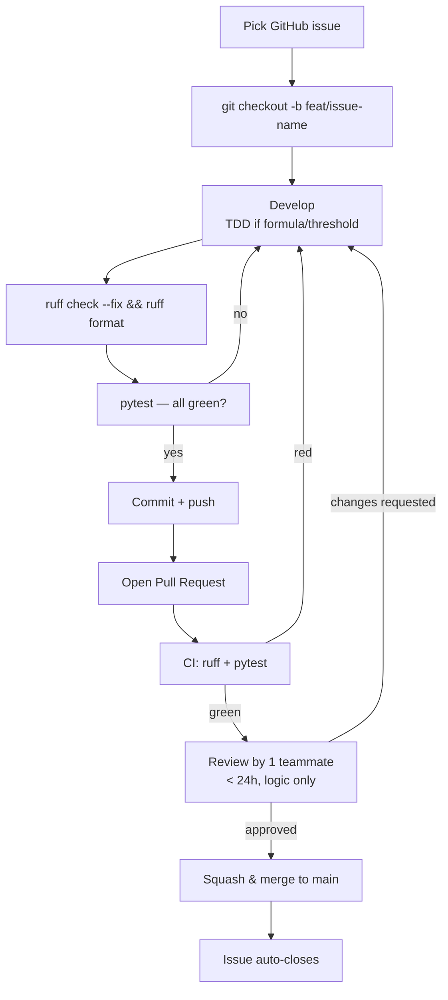

# ClimatePrice — Engineering Practices

Production-quality habits, MVP-sized. 4 devs · 4 weeks · part-time · AI-assisted.
Rule of thumb throughout: **if a practice costs more than 10 min/week per person, it's out.**

---

## 1. Testing Strategy

**The pyramid, adapted to a data pipeline:**

| Layer | What | Where | When it runs |
|---|---|---|---|
| Unit | One function, pure logic (formulas, naming, thresholds) | `tests/test_pipeline.py::TestModels` | every commit |
| Integration / contract | Script outputs respect the data contract (`joined.geojson` columns, types, ranges) | `tests/test_pipeline.py::TestContract` | every commit |
| Sanity (our "E2E") | Full pipeline output makes real-world sense (riverside band, verdict flips) | `tests/test_pipeline.py::TestSanity` | every commit |
| Visual E2E | The Streamlit app renders, toggles work, cards open | human, checklist | weekly + before demo |

**What we test:** formulas (discount, verdict thresholds), data contracts, model output bounds, monotonicity (SSP5 ≥ SSP2), sanity of distributions.

**What we deliberately DON'T test:** Streamlit UI code (eyes are cheaper), plotting, xgboost/sklearn internals (they have their own tests), download scripts (run twice total).

**Framework:** pytest only. No unittest, no nose, no plugins beyond pytest-cov.

**Coverage:** measure it (`pytest --cov`), don't worship it. Target ~70% on `src/03_pipeline.py` and the join logic. 100% coverage of a 4-week MVP is time stolen from the demo. **The real coverage metric: every jury-facing number (price, discount, verdict) has at least one test asserting its bounds.**

---

## 2. Lightweight TDD

Full TDD (red-green-refactor for everything) would slow a bootcamp team. Use **TDD only where it pays:**

**Use TDD for:** formulas and thresholds (discount, verdicts, scores). These are jury-facing numbers — write the test first, e.g. "risk 100 + SSP5/2045 ⇒ discount = 15%", then implement.

**Skip TDD for:** data cleaning, geopandas plumbing, app UI. Write it, then add a contract test after.

**The workflow per developer:**
1. Pick an issue → read its Definition of Done
2. If it involves a formula/threshold → write the failing test first (5 min)
3. Code until green (AI assistants allowed — see §9)
4. Run `ruff check . --fix && ruff format . && pytest` locally
5. Push, open PR

That's TDD where it matters, pragmatism everywhere else.

---

## 3. Ruff (linter + formatter)

Config lives in `pyproject.toml` (already set up and validated on our codebase — it caught 8 real issues on first run).

**Why Ruff:** it replaces flake8 + isort + black + pyupgrade in one tool, runs in milliseconds, and auto-fixes most of what it finds. One tool, one config, zero debate about style in code review — reviews talk about *logic*, never about commas.

**Key choices, and why:**
- `line-length = 100` — data code has long chained pandas calls; 88 causes ugly wraps
- `E`, `F` (bugs), `I` (import order), `B` (bugbear traps), `UP`, `PD` (pandas anti-patterns), `NPY` — all high signal
- Ignore `E501` (formatter owns line length)
- Exclude `data/`, `notebooks/`, `*.ipynb` — exploration stays free
- **Practice:** run `ruff check . --fix && ruff format .` before every commit. CI enforces it, so you can't forget for long.

---

## 4. Code Quality Tools — verdicts for a 1-month MVP

| Tool | Verdict | Why |
|---|---|---|
| **pytest** | ✅ mandatory | Already in place, 20 tests, runs in <1s |
| **Ruff** | ✅ mandatory | Free quality, zero maintenance |
| **pre-commit** | ✅ yes, minimal | 5-min setup, runs ruff+format automatically on commit. Config included. |
| **coverage.py** | 🟡 optional | Run `pytest --cov` weekly out of curiosity; don't gate on it |
| **mypy** | ❌ skip | Type-checking geopandas/pandas code = fighting stubs for days. Wrong battle for 4 weeks. Type *hints* in signatures welcome, checker not enforced. |
| **Docker** | ❌ skip | requirements + README suffice for 4 laptops |

---

## 5. Development Workflow

**Branch names:** `feat/`, `fix/`, `data/` + short slug (`feat/kmeans-naming`).
**main is protected:** no direct pushes, PR + green CI required. main must always run the demo.

---

## 6. GitHub Actions CI

File: `.github/workflows/ci.yml` (included). Every push/PR: install deps (cached) → `ruff check` → `ruff format --check` → `pytest`. Red CI blocks merge. Total runtime ≈ 1-2 min.

---

## 7. README

`README.md` included — overview, features, architecture, install, run, test, lint, folder structure, team, license. Keep the "Running locally" section accurate above all: **it's the first thing the jury's technical member will try.**

---

## 8. Definition of Done (every issue)

An issue is Done when ALL boxes tick:

- [ ] Code merged to `main` via reviewed PR
- [ ] `pytest` green locally and in CI
- [ ] `ruff check` + `ruff format --check` pass (CI enforces)
- [ ] New formula/threshold → has its own test
- [ ] Contract change → `tests/test_pipeline.py` CONFIG + docs updated
- [ ] README updated if setup/run steps changed
- [ ] Feature demonstrated (screenshot or 30s screen-share in Slack)

Copy this into a GitHub issue template (`.github/ISSUE_TEMPLATE/`) so it appears automatically.

---

## 9. The Process — 4 devs, 4 weeks, part-time, AI-assisted

**Cadence (total ~45 min/week of process):**
- **Async daily:** one Slack line each — yesterday / today / blocked. No meeting.
- **Weekly 30-min sync:** demo what works, walk the ROADMAP milestones, tick CHECKLIST.md, reassign if someone's stuck.
- **PM (Zakaria) runs the board;** each dev owns their stream end to end.

**Git discipline:**
- Small PRs (< ~300 lines) — reviewable in 10 min; giant PRs rot for days
- Review within 24h or ping; if still stuck, PM arbitrates
- Never break the contract silently: changing `joined.geojson` columns requires updating tests + telling the team in Slack

**AI-assisted coding rules (Claude/ChatGPT/Copilot):**
1. AI writes code, **humans own it** — you must be able to explain every merged line to the jury
2. Paste our data contract + relevant test into the prompt — grounded output beats generic output
3. AI-generated code passes the same gate: ruff + pytest + review. No exceptions because "the AI wrote it"
4. Use AI *heavily* for: tests, docstrings, geopandas syntax, Streamlit boilerplate. Use it *carefully* for: formulas and thresholds (jury-facing — verify by hand)

**Demo Day optimization:**
- Week 4 = freeze (ROADMAP rule). Only fixes, polish, pitch
- `main` must demo at any moment from week 2 — practice `git clone && make run` on a clean machine once
- Screenshot the green CI + 20/20 pytest wall for the deck: 10 seconds of slide, big credibility
